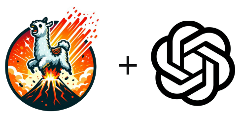

# llava-benchmark 🌋
[](https://github.com/jcassady/llava-benchmark/actions/workflows/pytests.yml)
[](https://codecov.io/gh/jcassady/llava-benchmark)
[](/LICENSE)





## Contents
- [AI Benchmarking Tool 🦙](#ai-benchmarking-tool)
    * [Included Benchmarks](#included-benchmarks)
- [Requirements 📋](#requirements)
- [Cloning the Repository 🚀](#cloning-the-repository)
- [Setting Up the Project](#setting-up-the-project)
- [Configuration 📝](#configuration)
- [Usage 🛠️](#usage)
    * [Command Line 🖥️](#command-line)
- [Documentation 📄](#documentation)
    - [Benchmark Classes 📚](#benchmark-classes)
        * [Benchmark class](#benchmark-class)
        * [EvalRateBenchmark class](#evalratebenchmark-class)
        * [LicensePlateBenchmark class](#licenseplatebenchmark-class)
        * [CallAudioBenchmark class](#callaudiobenchmark-class)
- [Extensibility 🔗](#extensibility)
- [Testing 🧪](#testing)
    * [Running the Tests 🏃](#running-the-tests)
- [Contributing 🤝](#contributing)
- [About 🧑‍💻](#about)
- [License 📄](#license)

## AI Benchmarking Tool

`llava-benchmark` is a general purpose benchmarking tool designed to evaluate the
image and audio processing capabilities of [LLaVA](https://github.com/haotian-liu/LLaVA)
models with [Ollama](https://ollama.com).

### Included Benchmarks
* `EvalRateBenchmark`: Measure model image processing speed 📈 
  *  Powered by [Ollama](https://ollama.com/) timing metrics
* `LicensePlateBenchmark`: Extract license plate numbers from processed images 🚗
  * Powered by [LLaVA](https://llava-vl.github.io/) **Optical Character Recognition (OCR)**
* `CallAudioBenchmark`: Transcribe phone calls to summarized call notes from audio files 📱
  * Powered by OpenAI's [Whisper](https://github.com/openai/whisper) **Automatic Speech Recognition (ASR)**
    and [LLaVA](https://llava-vl.github.io/) for call notes summarization

By running these benchmarks, you can quickly assess how well different `LLaVA` models
perform when asked to **read license plate numbers from images**, or **summarize an audio call
recording as meeting notes**.

## Requirements

- [Python 3](https://python.org/downloads) 🐍
- [Ollama](https://ollama.com/download) 🦙
- Packages: `asciichartpy`, `os`, `pytest`, `shutil`, `subprocess`, `yaml`, `whisper`

## Cloning the Repository

Before running `llava-benchmark`, clone the repository to your local machine:

1. **Open a Terminal**: On Windows, you can use Command Prompt or PowerShell.
On macOS or Linux, you can use Terminal.

2. **Navigate to the Desired Directory**: Use the `cd` command to navigate to
the directory where you want to clone the repository.

3. **Clone the Repository**: Run the following command to clone the repository:

```bash
git clone https://github.com/jcassady/llava-benchmark.git
```

## Setting Up the Project

Follow these steps after cloning into the local `llava-benchmark/` repo directory:

1. **Create a Virtual Environment**:
    ```bash
    python -m venv .venv
    ```

2. **Activate the Virtual Environment**:
    - On Windows:
        ```bash
        .venv\Scripts\Activate.ps1
        ```
    - On Linux or MacOS:
        ```bash
        source .venv/bin/activate
        ```

3. **Install the Dependencies**:
    ```bash
    pip install -r requirements.txt
    ```


## Configuration

The tool uses YAML configuration file `data/config.yml` to specify the `models`,
`prompts`, and `media` files for the benchmark to use.

Here's a brief explanation of each section:

- `models`: This lists the models to be benchmarked
- `prompts`: This lists the prompts to be used for each model
- `media`: This lists the file names to be used in the benchmark

`LicensePlateBenchmark` configuration lists images of license plates:
```yaml
# data/config_license_plates.yml
models:
  - llava:latest
  - llava-llama3:8b
prompts:
  - >-
    Read and return the license plate number and letters
    as text on a new line as plain text:
images:
  - 1.jpg
  - 2.jpg
```

`CallAudioBenchmark` configuration lists audio files of phone calls:
```yaml
# data/config_call_audio.yml
models:
  - llava:latest
  - llava-llama3:8b
prompts:
  - >-
    Summarize the key points of this audio call
    transcript in point form as call notes:
images:
  - 1.mp3
  - 2.mp3
```

## Usage
When you execute `llava_benchmark.py`, it performs a series of operations:
1. **Checks if Ollama is Installed**: The script checks if the `ollama` binary is present
on your system. If not, it will print an error message and exit.

2. **Checks if the model is Installed**: For each model specified in the YAML configuration
file, the script checks if the model is installed. If a model is not found, it will print a
message and skip that model.

3. **Runs the Benchmark**: For each model, prompt, and media file specified in the YAML
configuration file, the script runs the `ollama` command and stores the evaluation
rate and any relevant test result data.

4. **Prints the Average Evaluation Rate**: After running the benchmark for all models,
prompts, and media files, the script prints the average evaluation rate for each model.

5. **Plots the Evaluation Rate Chart**: The script plots an ASCII line chart of the
evaluation rates for visual analysis.

### Command Line
To run the script, navigate to the root directory containing the `llava_benchmark.py`
script and use the `--media license_plates` argument to run the `LicensePlateBenchmark`:

```bash
$ python llava_benchmark.py --media license_plates
========================================
🦙  MODEL: llava:latest 🦙
========================================
PROMPT:
 Read and return the license plate
 number and letters as text on a new
 line as plain text:


DATA\IMAGES\1.JPG       📁
◽ Tokens/s:    55.56   📈
◽ Plate:       K5210V  🚗

DATA\IMAGES\2.JPG       📁
◽ Tokens/s:    54.73   📈
◽ Plate:       PAX 44  🚗

----------------------------------------
Average eval rate: 56.833 📊
----------------------------------------

                Y-axis: Evaluation Rates
                X-axis: Images
   76.07 ┤
   71.52 ┤             ╭─╮ ╭─
   66.96 ┤             │ │ │
   62.41 ┤ ╭─╮         │ │ │
   57.85 ┼─╯ ╰─╮ ╭─╮ ╭─╯ ╰─╯
   53.30 ┤     ╰─╯ ╰─╯

```
To run the `CallAudioBenchmark`, use the `--media call_audio` argument:
```bash
$ python llava_benchmark.py --media call_audio
========================================
🦙  MODEL: llava:latest 🦙
========================================
PROMPT:
 Summarize the key points of this audio
 call transcript in point form as call
 notes:


DATA\CALL_AUDIO\1.MP3   📁
◽ Tokens/s:    51.64   📈
----------------------------------------

CALL NOTES:
| * Cloud network temporarily shut down
| due to non-payment of subscription
| * Circumstances can change and
| assistance is available
| * Payment needed to reactivate
| services
| * Internet connectivity issues can be
| addressed by contacting local provider
| * Once online, assistance will be
| provided


DATA\CALL_AUDIO\2.MP3   📁
◽ Tokens/s:    51.23   📈
----------------------------------------

CALL NOTES:
| Call Notes:

| * App being discussed is a meditation
| app
| * The app is described as more potent
| than a triple shot almond milk latte
| and is disrupting the sharing economy
| * Unicorn mascots in augmented reality
| glasses are mentioned
| * Flash mob IPO with dancers spelling
| out stock ticker in Times Square
| * Ocha, Man-Bun, Kombatcha, Aficionado
| terms listed


----------------------------------------
Average eval rate: 51.435 📊
----------------------------------------

                Y-axis: Evaluation Rates
                X-axis: Media
   51.64 ┼─╮
   51.56 ┤ │
   51.48 ┤ │
   51.39 ┤ │
   51.31 ┤ ╰─
   51.23 ┤
```


## Documentation
The source code for the project includes comprehensive documentation comments
and docstrings. Automatically generated HTML docs can be viewed on GitHub Pages:

https://jcassady.github.io/llava-benchmark/ 📄

Please see the source files, including `__init__.py` files for comments and
additional information on the structure and organization of this project.


### Benchmark Classes
#### EvalRateBenchmark class
The `EvalRateBenchmark` class is initialized to process and store the evaluation rates
from a benchmark's result. Eval rates provide metrics measured in tokens/s, and chart
performance differences between models and media files under test.

#### LicensePlateBenchmark class
The `LicensePlateBenchmark` class is initialized to process the license plate from
an image file. License plate numbers are read with a compatible `LLaVA` model, then returned
alongside the benchmark result containing the eval rate produced by `EvalRateBenchmark`.

#### CallAudioBenchmark class
The `CallAudioBenchmark` class is initialized to process call audio recordings via
speech-to-text transcription with OpenAI's `whisper` library. Local `LLaVA` models
summarize the transcripts into call notes, which are returned alongside the benchmark
result from `EvalRateBenchmark`.


#### Extensibility
The project is designed to be easily extendable for other LLaVA-compatible tasks.
This is done through the use of benchmark objects, which are instances of classes that
define specific tasks.

In the main function of `llava_benchmark.py`, instances of `EvalRateBenchmark`
and `LicensePlateBenchmark` are executed when the `--media` argument `license_plates`
is used:
```python
   # python llava_benchmark.py --media license_plates
   if args.media == "license_plates":
        benchmarks = [EvalRateBenchmark(), LicensePlateBenchmark()]
        llava_benchmark("data/config_licence_plates.yml", benchmarks)
```

The `--media` argument `call_audio` can be used to run an instances of
`EvalRateBenchmark` and `CallAudioBenchmark`: 
```python
    # python llava_benchmark.py --media call_audio
    elif args.media == "call_audio":
        benchmarks = [EvalRateBenchmark(), CallAudioBenchmark()]
        llava_benchmark("data/config_call_audio.yml", benchmarks)
```

To extend the script for other LLAVA tasks, you can define new benchmark classes that
implement the code needed for those tasks. Then, you can create instances of those
classes and add them to the `benchmarks` list by processing `args.media`.

## Testing
The `llava-benchmark` module includes a suite of tests to ensure its functionality.
These tests are written using the `pytest` framework and make use of fixtures and
parameterization to test various aspects of the benchmarking process.

### Running the Tests
To run the tests, navigate to the `llava-benchmark/tests/` directory and execute
the following command:
```bash
$ pytest
======================================================== test session starts =========================================================
rootdir: ./llava-benchmark
collected 2 items                                                                                                                     

tests\test_eval_rate_benchmark.py .                                                                                             [ 50%] 
tests\test_license_plate_benchmark.py .                                                                                         [100%] 

========================================================= 2 passed in 0.08s ==========================================================
```

## Contributing

Contributions are welcome to the `llava-benchmark` project! If you're interested in
contributing, here's how you can do it:

1. **Open an Issue**: If you have a suggestion for an improvement, or you've found
a bug, start by opening an issue in the project repository. Describe your suggestion
or bug report in detail.

2. **Discussion**: Once the issue is opened, maintainers of the project or other
contributors will review the issue and discuss it.

3. **Implementation**: If your suggestion is accepted, you or someone else can
start working on implementing it.

We appreciate your help in making the LLaVA Benchmark project better!

## About 

[Jordan Cassady](https://jordan.cassady.me) is a Canadian Network Engineer
with a decade of startup experience automating test systems aligned to
company KPIs. If you’ve got a puzzle to solve, a codebase to conquer,
or a moonshot idea, count me in. Let’s connect! ✌️

👉 https://www.linkedin.com/in/jordancassady/


## License

This project is licensed under the terms of the MIT license.
